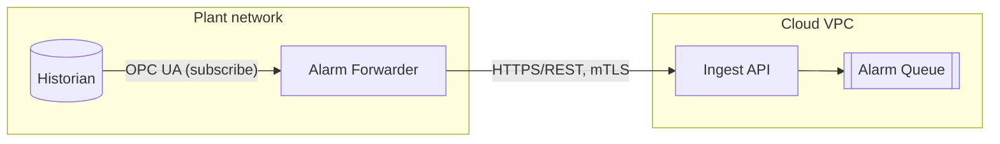
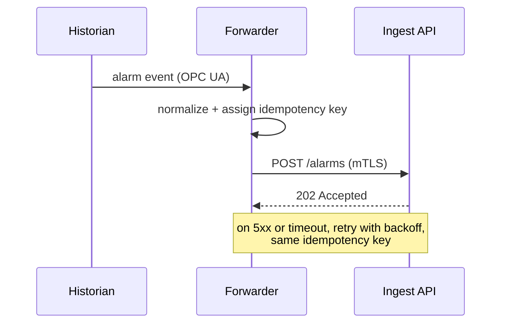
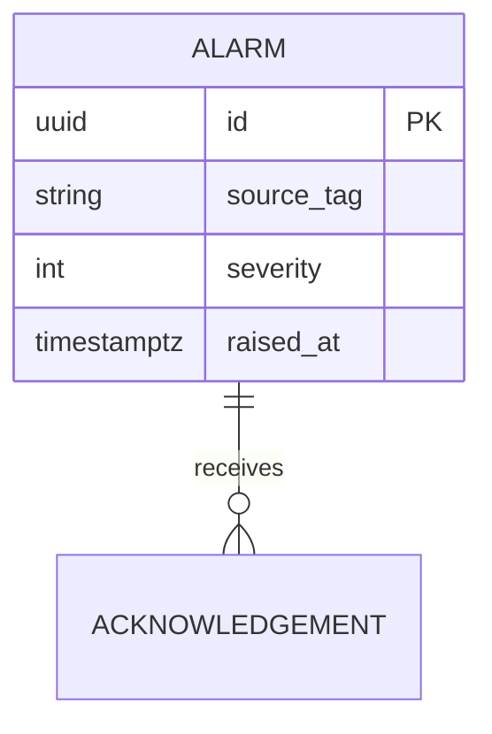

# Design Document

A Design Document explains **what is being built, how it works, and why this shape was chosen**, for a reader who knows the domain but not this system. It is read by engineers who will build it, reviewers who will approve it, and operators who will run it. Write for that reader. Assume protocols, data structures, and failure modes are familiar. Assume this system is not.

## What belongs here

The mechanism, and the reasoning behind it. Anything a builder, reviewer, or operator must know to do their job.

What does **not** belong here, no matter how much the author wants to say it: business justification, cost and effort estimates, stakeholder impact, training and support implications, rollout communications, and benefit claims. Those belong in a solution document. A design document that starts arguing for the project has drifted into being a different document, and will be read by neither audience well.

## Relationship to the solution document

A solution document answers *what problem is being solved, what changes for the people affected, and why this shape over the alternatives*, for readers who will not build the thing. A design document answers *how it works*, for readers who will. Where both exist, they are separate documents with separate audiences, not two lengths of the same one.

A solution document can be derived from a completed design document, and this is the cheaper direction. A solution document is organized as Introduction, Requirements, Solution, Concerns, and Appendix, and roughly two thirds of a design document converts into it:

| From this design document | Becomes |
|---|---|
| Purpose | Introduction > Problem Statement |
| Overview | Introduction > Overview, Introduction > Background |
| Goals and non-goals | Requirements > Functional |
| Performance targets | Requirements > Non-Functional |
| Deployment environment and dependencies | Requirements > Constraints |
| Architecture Diagram | Solution > Architecture Diagram, redrawn for a non-engineer |
| Alternatives Considered | Solution > Alternatives, internals dropped |
| Fault Tolerance | Concerns > Behavior When Things Go Wrong, as guarantees rather than mechanisms |
| Security | Concerns > Risks, phrased as consequences to people |
| Testability | Concerns > Validation |
| Terms and Acronyms | Appendix > Glossary, rewritten for a non-engineer |

What cannot be derived and must be gathered separately: scope boundaries, cost, stakeholder impact, delivery plan, and risk ownership. When asked to produce a solution document from a design document, derive what converts and raise the rest as open questions rather than inventing it.

## Before writing

Gather enough to write concretely, in this order:

1. **The problem and the trigger.** What changes if this is not built.
2. **The existing system.** Read the code/config/infra it touches. Every claim about current behavior must come from something you actually looked at, not from the name of a service.
3. **Constraints.** Deadlines, platforms, protocols, standards, team skills, licensing, existing vendors.
4. **Non-functional targets.** Throughput, latency, availability, retention, RPO/RTO.

If a fact is unknown, do not invent it. Write the section around what is known and add the gap to **Open Questions** with a named owner if one is known. A design doc with five honest open questions is far more useful than one with five confident fabrications.

## Structure

Follow this section order. Omit a section only when it genuinely does not apply, and say so in one line (`*Not applicable. This change adds no new persisted state.*`) rather than deleting the heading silently.

Start from `template.md` in this skill directory. Copy it and fill it in.

### 1. Purpose

One to three sentences. What this document describes and for which system or change. No background, no motivation, no history. A reader must know within five seconds whether this is the document they want.

> This document describes the design of the alarm-forwarding service that relays SCADA alarms from the plant historian to the on-call paging platform.

### 2. Terms and Acronyms

A two-column table, `Term` | `Definition`. Include every acronym, product name, and domain word that a competent engineer outside this specific project would not know. Sort alphabetically. Do not pad it with universally known terms (HTTP, JSON, CPU). Expand each acronym on the term side: `RTU` → `Remote Terminal Unit`.

### 3. Reference Documents

A two-column table, `Name` | `Description`. Link the name where a link exists. Cover: requirements or tickets this design answers, protocol/standard specs it must conform to, vendor documentation, and any prior design documents it supersedes or extends. The description says *why the reader would open it*, not what it is called again.

### 4. Design

The body of the document. Describes the chosen design only. Alternatives belong in section 5.

#### 4.1 Overview

One to three paragraphs of prose describing the design end to end: the components, who calls whom, where data lands, and the one or two decisions that shape everything else. A reader should be able to stop after the overview and still describe the design correctly at a whiteboard.

Prose, not bullets. Bullets here hide the relationships between components, which is exactly what this section exists to convey.

#### 4.2 Architecture Diagram

A component/deployment view. Boxes for processes, stores, and external systems, with arrows labeled by **protocol and direction** (`HTTPS/REST`, `MQTT (TLS)`, `OPC UA`). Show trust or network boundaries (DMZ, plant network, cloud VPC) as containers. Keep it to one page. If it does not fit, the diagram is showing more than one level of abstraction.

Use Mermaid so it stays diffable:

Follow the diagram with a short legend or paragraph naming each component's responsibility in one line. A diagram nobody can read without the author present is not documentation.

#### 4.3 Fault Tolerance

For each failure that is plausible in operation, state **detection → behavior → recovery**. Work through, at minimum: each dependency being unavailable or slow, the service itself crashing or being restarted, the network partitioning, and a poisoned or malformed message.

Be explicit about the properties that reviewers will otherwise have to guess:

- Retry policy (attempts, backoff, jitter) and what makes a retry safe.
- Idempotency: the key used, and what happens on duplicate delivery.
- Delivery semantics: at-most-once, at-least-once, or exactly-once, and the mechanism that earns it.
- What is buffered where, how large the buffer is, and what is dropped when it fills.
- Failover and redundancy: active/active or active/passive, how failover is triggered, expected time.
- State that survives a restart, and what is lost.

State RPO and RTO targets if the system has them.

#### 4.4 Security

Cover, in this order:

- **Authentication.** How each caller proves identity (mTLS, OAuth2 client credentials, API key, AD/LDAP), for both human and machine callers.
- **Authorization.** Roles/scopes and what each may do.
- **Secrets and key management.** Where credentials live, how they are rotated. Never put a credential in the document.
- **Data protection.** In transit (TLS version, cipher constraints) and at rest (what is encrypted, with what key).
- **Network exposure.** Listening ports, ingress/egress rules, firewall changes required.
- **Auditing.** Which security-relevant events are recorded, and where.
- **Threats considered.** The handful worth naming, with the mitigation for each.

Name the compliance or standards regime if one applies (IEC 62443, ISO 27001, SOC 2, PCI DSS) and how the design satisfies it.

#### 4.5 Data Flow

Trace the data through the system for the primary scenario, then for the significant exception paths. A sequence diagram carries this far better than prose. Use one whenever more than two participants interact or ordering matters:

Alongside the diagram, state the trigger, the ordering and timing guarantees, the transformation applied at each hop, and the volume expected (events/sec, payload size). Show the error path: where a failed message goes and who sees it.

#### 4.6 Data Model

The entities the system persists or exchanges, their key fields, types, and relationships. Use an ER diagram or class diagram for structure and a table for field-level detail:

Also cover: primary and natural keys, indexes that the access patterns require, retention and archival, timezone and precision handling for timestamps, units for physical quantities, and how schema changes will be migrated. Where the model is a message contract rather than a table, say which side owns it and how it is versioned.

#### 4.7 API Specification

Include when the design exposes or consumes an interface. For each operation give: method and path (or RPC/topic name), request and response schema, status codes and error shape, authentication required, idempotency and rate-limiting behavior, and a worked example request/response. State the versioning scheme and the compatibility promise.

For a large surface, link the OpenAPI/AsyncAPI/proto file as the source of truth and summarize only the operations and the conventions here. Do not hand-transcribe a spec that will drift.

If nothing new is exposed or consumed, say so and move on.

#### 4.8 Performance

State the **targets** first, as numbers: throughput, latency (p50/p95/p99), concurrency, data volume and growth rate. Then explain how the design meets them, covering the sizing, the caching, the batching, and the parallelism, and name the expected bottleneck. Note the scaling axis (vertical, horizontal, partitioned by what key) and any hard limit in a dependency (connection pool size, vendor license, device poll rate). Say how the targets will be validated: load test, soak test, or production measurement.

#### 4.9 Observability

- **Metrics.** The handful that indicate health, with names and units. Include the ones that reveal the failure modes named in Fault Tolerance (queue depth, retry count, age of oldest unprocessed item).
- **Logs.** Format (structured/JSON), levels, correlation/trace ID propagation, and what must never be logged (secrets, PII).
- **Traces.** Spans of interest, if distributed tracing is in play.
- **Alerts.** Condition, threshold, severity, and who is paged. An alert with no owner and no runbook step is noise.
- **Dashboards and health checks.** Liveness/readiness endpoints and what they actually check.

#### 4.10 Testability

How the claims in this document are shown to be true. Organise by the property under test, not by test framework, and make each entry name a case that could actually fail:

- **Correctness of the core mechanism.** The boundary and edge cases the design turns on. Off-by-one at every limit, empty and single-element inputs, and the exact conditions the Fault Tolerance section says are handled.
- **The failure modes.** Each row of the Fault Tolerance table is a test. If a failure mode cannot be provoked in a test environment, say how it will be validated instead.
- **Compatibility.** That existing callers see byte-identical behavior, where the design claims they do.
- **Non-functional targets.** Which of the Performance numbers are measured, by what test, against what data volume.

Name anything that is deliberately not covered and why. A design whose central guarantee has no stated way to be tested is not ready for review.

#### 4.11 Deployment and Compatibility

How the change reaches production without breaking what is already there:

- **Compatibility promise.** What existing callers, data, and configuration see after deployment. If the change is additive and old behavior is preserved on the old path, say so explicitly. This is usually the single most reassuring sentence in the document.
- **Deployment order.** Which components must be upgraded before which, and whether mixed versions are supported during the rollout.
- **Migration.** Data or configuration that must be converted, whether it is reversible, and how long it takes.
- **Rollback.** What returns the system to its prior state, and anything that cannot be rolled back once it has run.
- **Configuration.** New settings, their defaults, and whether a default change alters existing behavior.

### 5. Alternatives Considered

Include only when a real alternative was considered. For each, a subsection named for the option containing:

- **Description.** Enough to make it concrete, a few sentences.
- **Tradeoffs.** What it does better and worse than the chosen design. Both directions, honestly. If an alternative has no advantages, it was not a real alternative and does not belong here.
- **Justification.** Why it was not chosen: the specific constraint, cost, risk, or requirement that ruled it out.

A comparison table across options (cost, effort, latency, operational burden, vendor lock-in) helps reviewers scan, but never replaces the per-option prose.

### 6. Open Questions

A table of `#` | `Question` | `Owner` | `Status` (or a numbered list where ownership is not tracked). Every question must be answerable. Phrase it so a yes/no or a value settles it. Include decisions deferred to implementation, unvalidated assumptions, and dependencies on other teams. Note which questions block the design being approved versus merely block work starting.

Keep this section in the document after approval. It becomes the record of what was still unknown when the design was signed off.

## Writing standard

Follow the Google developer documentation style guide, then run the `unslop` skill over the draft
before sending it for review.

### Google style

- **Present tense, active voice.** "The forwarder retries with exponential backoff", not "we will make it retry" or "it was decided that retries would be performed".
- **Describe the system in the third person, address the reader in the second.** The components are "the forwarder" and "the ingest API", never "we" or "our service". Where the document tells a reader to do something, say "you", as in "you need the certificate in place before the first deploy". A design document rarely addresses the reader, so most sentences are third person.
- **US English spelling.** Behavior, authorization, normalize, labeled, license, analyze.
- **Sentence case for any heading you add** beyond the fixed ones in `template.md`.
- **Expand acronyms on first use**, then use the acronym. Every acronym also appears in Terms and Acronyms.
- **No Latin abbreviations.** Write "for example" and "that is", not "e.g." and "i.e.".
- **Serial comma.** "Detection, behavior, and recovery".
- **"Might", not "may"**, for possibility. Reserve "may" for permission, which matters in a document that also describes authorization.
- **Drop the filler.** No "simply", "just", "easily", "obviously", or "of course". A mechanism a reviewer has to check is never obvious.
- **No anthropomorphism.** A service doesn't want, think, or try. It retries, blocks, or fails.
- **Descriptive link text.** Name the document or the spec, not "click here" or a bare URL. This applies to Reference Documents in particular.
- **Contractions are fine.** They keep the tone level and readable.
- **Inclusive, neutral language.** Use "they" for a person whose pronouns you don't know. Prefer "allowlist" and "primary/standby" to the older terms.

### Rules specific to a design document

- **Numbers over adjectives.** Not "high throughput" but "3,000 events/sec sustained, 10,000 peak". Not "quickly" but "within 200 ms". If a number is unknown, mark it `TBD` and raise it in Open Questions.
- **Decisions with reasons.** Whenever the document states a choice, the sentence after it says why. A design doc that records only outcomes cannot be reviewed.
- **Diagrams in Mermaid**, so they live in version control and change with the design. Every diagram needs a caption or a lead-in sentence saying what to look at. Where the publishing target cannot render Mermaid, export an image for it but keep the Mermaid source in the repository as the thing that gets edited.
- **No implementation detail that will rot.** No line numbers, no function names, no copied code blocks longer than a few lines. Describe the contract, not the code.
- **Consistent naming.** One name per component, matching what appears in the diagrams, the code, and the deployment.

### Cut the AI tells

A design document that reads as machine-written gets skimmed instead of reviewed, and a skimmed
design document is an unreviewed one. When the draft is complete, run the `unslop` skill over it and
fix what it finds. The patterns that show up most in this kind of document:

- **Em dashes.** Use a period or a comma. In a bulleted definition list, write `**Label.** Definition` rather than `**Label** — definition`.
- **Semicolons and mid-sentence colons.** Split the sentence. A colon is fine before a list or an example.
- **Bold used mid-sentence** to signal that a phrase matters. Bold belongs on the labels that open a bullet and on nothing else. The tables and headings carry the rest of the emphasis.
- **Curly quotes**, usually pasted in from Confluence or a word processor. Replace with straight quotes, which also keeps code and config values copyable.
- **Phrases that announce importance** rather than stating the point: "load-bearing", "carries the real weight", "it's worth noting that", "the key insight is". Delete the announcement and keep the point.
- **"Not just X, but Y."** Say Y.
- **Inflated word choice.** "Use", not "utilize". "Enough", not "sufficient". "Start", not "commence". "Before", not "prior to".
- **Padding that survives from an outline**, such as a paragraph that restates the section heading before saying anything, or a closing sentence that summarizes three bullets the reader has already read.

Two cautions. Don't let the pass flatten the numbers, the `TBD` markers, or the named owners, which
are the parts a reviewer acts on. And run it over the tables and the diagram labels as well as the
prose, because a Fault Tolerance row written in slop is as visible as a paragraph.

## Reviewing an existing design document

Check, in order:

1. Could someone build this without asking the author a question? Every gap is either an Open Question or a defect.
2. Does every diagram match the prose around it, and every component in the prose appear in a diagram?
3. Are the non-functional sections (fault tolerance, security, performance, observability) specific to *this* system, or generic text that would apply to anything?
4. Are the failure modes in Fault Tolerance each visible through something in Observability?
5. Does each stated decision have a stated reason?
6. Are the alternatives argued fairly, or set up to lose?
7. Is anything here business justification, cost, or stakeholder impact that belongs in a solution document instead?
8. Can the change be deployed and rolled back from what the document says, and does every guarantee it claims have a test behind it?
9. Does the prose hold to Google style: present tense, active voice, US spelling, no Latin abbreviations, no "simply" or "just"?
10. Has the `unslop` pass been run? Check the tells directly: em dashes, semicolons, mid-sentence bold, curly quotes, "not just X, but Y", and phrases that announce importance instead of stating the point.
