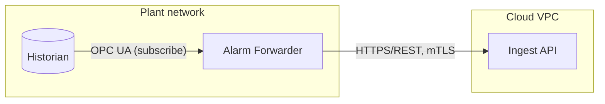

# Design Document

A Design Document explains **what is being built, how it works, and why this shape was chosen**. Its readers are the engineers who build the system, the reviewers who approve it, and the operators who run it. Assume they know the domain, the protocols, and the failure modes. Assume they don't know this system.

## What belongs here

The mechanism and the reasoning behind it. Not business justification, cost, stakeholder impact, training, rollout communications, or benefit claims. Those belong in a solution document, written with the `solution-document` skill, which also covers deriving one from a design document. A design document that argues for the project serves neither audience.

## Before writing

Gather these, in order:

1. **The problem and the trigger.** What changes if this isn't built.
2. **The existing system.** Read the code, configuration, and infrastructure it touches. Every claim about current behavior comes from something you looked at, not from the name of a service.
3. **Constraints.** Deadlines, platforms, protocols, standards, licensing, and existing vendors.
4. **Non-functional targets.** Throughput, latency, availability, retention, capacity, and RPO/RTO.

Don't invent an unknown fact. Mark it in place as `**TBD:** <the question that settles it> (Owner: <name or role>)`, and say whether it blocks approval or only blocks work starting. Reviewers find every gap by searching for `TBD`.

## Structure

Copy `template.md` and fill it in. The template gives the headings, their order, and the fields each section needs. Keep every heading. If a section doesn't apply, say so in one line, such as `*Not applicable. This change adds no new persisted state.*`

The guidance below covers what the template can't show.

### Project Context

- **Purpose.** What the document describes and the technical trigger for the change. No business case or history. The first sentence tells a reader whether this is the document they want.
- **Overview.** The system as it is today and where the change fits. This is context. The design goes in Design Overview.
- **Scope.** The out-of-scope list matters more. List what a reviewer would assume is covered but isn't, such as data migration or a UI for a new setting.

### System Architecture

- **Design Overview.** One to three paragraphs of prose, not bullets, because bullets hide how the components relate. After reading it, a reader can describe the design correctly at a whiteboard.
- **Architecture Diagram.** Label each arrow with protocol and direction. Draw trust and network boundaries as containers. Keep it to one page. If it doesn't fit, it mixes levels of abstraction.
- **Modules.** One row per box in the diagram, with the same names. "Owns" is the state or data that only this module writes.
- **Alternatives.** Only real alternatives, which means each has at least one advantage. Give tradeoffs in both directions and the specific reason each was rejected.

### Operation

Numbers first, then how the design meets them.

- **Availability.** A system is no more available than a hard dependency it calls synchronously. Name those dependencies.
- **Scalability.** Name the stateful component that limits scale-out.
- **Performance.** Give the basis for every target and name the expected bottleneck. Validation goes in Testing.
- **Fault Tolerance.** Give detection, behavior, and recovery for at least: each dependency down or slow, the service restarting, a network partition, and a malformed message. State the retry, idempotency, and delivery properties explicitly, or reviewers will guess.
- **Disaster Recovery.** Loss of a site, a region, or a data store, not of a component. Say when the restore was last exercised.
- **Capacity.** How much the system must hold and when it runs out. Scalability covers how it grows.

### Revision

- **Testability.** The design properties that make testing possible, such as substitution seams, fault injection points, and deterministic time and IDs. The tests go in Testing. If the central guarantee can't be provoked outside production, say so here.

### Security

- **Security.** The system-wide controls. Never put a credential in the document.
- **Authentication and Authorization.** Cover human and machine callers. Name anything that runs with elevated privilege or bypasses access restrictions.
- **Privacy.** Check for operator names, badge IDs, and IP addresses before writing that the system holds no personal data.

### Usability

For a headless service, write "Not applicable" in one line.

- **Accessibility.** Color is never the only carrier of meaning, which matters most for alarm severity. CLI output reads correctly without color.
- **Localization.** Say what stays in English in every locale, such as logs and error codes.

### Data

- **Data flow.** Use a sequence diagram when more than two participants interact or order matters. Show the error path: where a failed message goes and who sees it.
- **Data models.** Cover the time zone and precision of timestamps and the units of physical quantities. For a message contract, say which side owns it and how it's versioned.

### Interfaces

- **API endpoints.** For a large surface, link the OpenAPI, AsyncAPI, or proto file as the source of truth instead of copying a spec that will drift. Include one worked request and response.
- **CLI parameters.** Scripts depend on option names and exit codes, so state the compatibility promise. Write the user guide separately with the `user-guide-cli` skill.

### Deployment

If old behavior is preserved, say so explicitly. It's usually the most reassuring sentence in the document. Name anything that can't be rolled back.

### File structure

Directories and the configuration files an operator edits, not every source file.

### Observability

Include a metric that reveals each Fault Tolerance failure, such as queue depth, retry count, or age of the oldest item. Every alert needs an owner and a runbook step.

### Testing

Organize by the property under test, not by framework. Each Fault Tolerance row is a test. Name what isn't covered and why. A design whose central guarantee has no test isn't ready for review.

### Appendix

- **References.** The description says why a reader would open the document.
- **Glossary.** Terms an engineer outside this project wouldn't know. Skip HTTP, JSON, and CPU.

## Writing standard

Use the `doc-style` skill, then run `unslop` over the finished draft, tables and diagram labels included. Don't let the pass remove numbers, `TBD` markers, or owners. Also:

- **Third person for the system.** "The forwarder retries", never "we" or "our service".
- **Numbers, not adjectives.** "3,000 events/sec sustained", not "high throughput".
- **A reason for every decision**, in the sentence that follows it.
- **Mermaid diagrams**, each with a caption saying what to look at.
- **No detail that will rot.** No line numbers, function names, or long code blocks. Describe the contract.
- **One name per component** across the diagrams, Modules, File structure, and code.

## Reviewing an existing design document

Check each section against the guidance above, then:

1. Could someone build this without asking the author a question? Every gap is a `TBD` with an owner, or a defect.
2. Does every diagram match its prose, and every box a row in Modules?
3. Is every Fault Tolerance failure visible in Observability and tested in Testing?
4. Are Operation, Security, and Observability specific to this system, or generic?
5. Are the alternatives argued fairly, or set up to lose?
6. Has business justification crept in that belongs in a solution document?
7. Have the `doc-style` and `unslop` passes been done?
