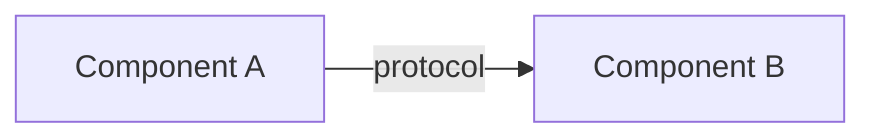
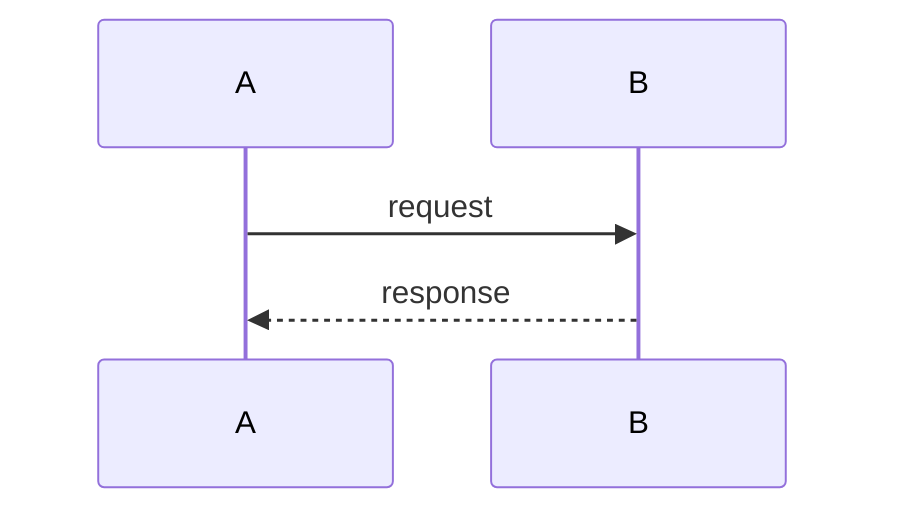
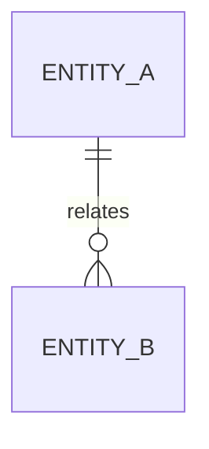

# \<System / Feature Name\>: Design Document

# Project Context

## Purpose

\<One or two paragraphs: what this document describes, for which system or change, and the technical problem or trigger that makes the change necessary.\>

## Overview

\<Where the system sits today: the existing system it changes or joins, its users, the upstream and downstream systems, and the current behavior this design changes.\>

## Scope

**In scope**

-

**Out of scope**

- \<Especially: what a reviewer would reasonably assume is included but isn't.\>

# System Architecture

## Design Overview

\<One to three paragraphs, end to end: the components, who calls whom, where data lands, and the decisions that shape the rest.\>

## Architecture Diagram



*\<Caption: what to look at in this diagram.\>*

## Modules

| Module | Responsibility | Owns | Depends on |
|---|---|---|---|
| | | | |

\<Prose for any module whose internals shape the design.\>

## Alternatives

### \<Option name\>

**Description:**

**Tradeoffs:**

| | Chosen design | \<Option name\> |
|---|---|---|
| | | |

**Justification:** \<why it was not chosen\>

# Operation

## Availability

**Target:**
**What counts as available:**
**Redundancy model:**
**Planned maintenance:**
**Dependencies that bound availability:**

## Scalability

**Scaling axis:**
**Stateful components:**
**Hard limits:**

## Performance

| Metric | Target | Basis |
|---|---|---|
| Throughput | | |
| Latency (p95) | | |
| Latency (p99) | | |

**How the design meets these:**
**Expected bottleneck:**

## Fault Tolerance

| Failure | Detection | Behavior | Recovery |
|---|---|---|---|
| | | | |

**Delivery semantics:**
**Idempotency:**
**Retry policy:**
**Buffering / backpressure:**
**State that survives a restart:**

- **Failover.** \<Active/active or active/passive, trigger, expected time.\>

## Disaster Recovery

**RPO / RTO:**
**Backups:** \<what, how often, where, retention\>
**Restore procedure:**
**What is lost:**

## Capacity

| Resource | Current | Projected (12 months) | Headroom | Limit |
|---|---|---|---|---|
| | | | | |

**When capacity must be added:**

# Revision

## Testability

**Seams for substituting dependencies:**
**Fault injection:**
**Deterministic time, IDs, and randomness:**
**Test environments and data:**
**Testable only in production, and why:**

# Security

## Security

**Secrets and key management:**
**Data in transit:**
**Data at rest:**
**Network exposure:**
**Auditing:**
**Compliance:**

| Threat | Mitigation |
|---|---|
| | |

### Authentication

\<How each human and machine caller proves identity.\>

### Authorization

| Role / scope | Permitted actions |
|---|---|
| | |

## Privacy

\<Personal data handled, or "Not applicable. This design handles no personal data."\>

| Data | Purpose | Retention | Who can access |
|---|---|---|---|
| | | | |

**Must never be logged:**
**Applicable regulation:**

# Usability

\<Or "Not applicable. This design has no human-facing surface."\>

## Accessibility

**Standard targeted:**
**Surfaces covered:**

## Localization

**Languages:**
**Locale-sensitive formatting:** \<dates, numbers, units, time zones\>
**Stays in English:**

# Data

## Data flow

**Trigger:**
**Volume:**
**Ordering / timing guarantees:**



**Exception paths:**

## Data models



| Field | Type | Units / Format | Notes |
|---|---|---|---|
| | | | |

**Keys and indexes:**
**Retention and archival:**
**Versioning / migration:**

# Interfaces

## API endpoints

\<Source of truth: link to OpenAPI / AsyncAPI / proto, or "Not applicable. This design exposes no API."\>

### \<METHOD /path\>

- **Purpose:**
- **Auth:**
- **Request:**
- **Response:**
- **Errors:**
- **Idempotency / rate limits:**

**Versioning and compatibility:**

## CLI parameters

\<Or "Not applicable. This design adds no command-line interface."\>

```text
<command> [options] <arguments>
```

| Option | Type | Default | Required | Environment variable | Description |
|---|---|---|---|---|---|
| | | | | | |

| Exit code | Meaning |
|---|---|
| 0 | Success |

**Output contract:** \<what goes to stdout, what goes to stderr\>
**Compatibility promise:**

# Deployment

**Target environment and packaging:**
**Compatibility promise:**
**Deployment order:**
**Migration:**
**Rollback:**
**New configuration and defaults:**

# File structure

```text
/opt/<system>/
├── bin/
├── etc/
└── var/log/
```

| Path | Purpose | Written by | Survives upgrade |
|---|---|---|---|
| | | | |

# Observability

| Metric | Unit | Indicates |
|---|---|---|
| | | |

**Logging:**
**Tracing:**

| Alert | Condition | Severity | Owner |
|---|---|---|---|
| | | | |

**Health checks / dashboards:**

# Testing

| Property under test | Case | How it is validated |
|---|---|---|
| | | |

**Not covered, and why:**

# Appendix

## References

| Name | Description |
|---|---|
| | |

## Glossary

| Term | Definition |
|---|---|
| | |

---

*Before sending this for review, search for `TBD` and confirm each has a question and an owner,
run the `unslop` skill over the whole document, tables and diagram labels included, and delete
this line.*
