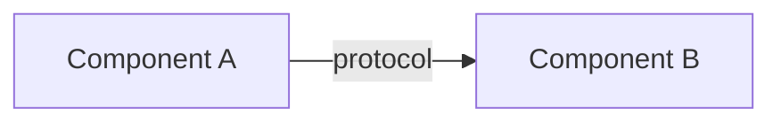
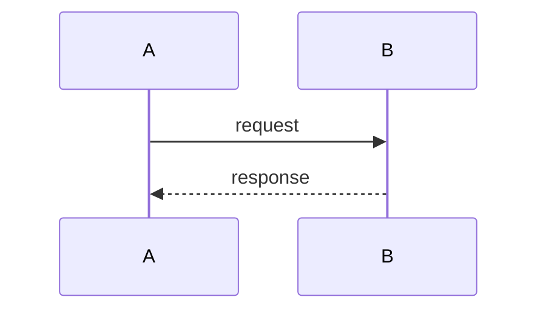
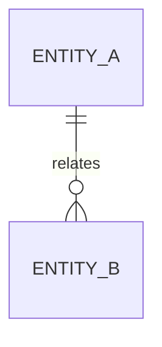

# \<System / Feature Name\>: Design Document

| | |
|---|---|
| **Author** | |
| **Status** | Draft / In Review / Approved |
| **Last updated** | YYYY-MM-DD |

## 1. Purpose

\<One to three sentences: what this document describes, for which system or change.\>

## 2. Terms and Acronyms

| Term | Definition |
|---|---|
| | |

## 3. Reference Documents

| Name | Description |
|---|---|
| | |

## 4. Design

### 4.1 Overview

\<One to three paragraphs, end to end: the components, who calls whom, where data lands, and the decisions that shape the rest.\>

### 4.2 Architecture Diagram

| Component | Responsibility |
|---|---|
| | |

### 4.3 Fault Tolerance

| Failure | Detection | Behavior | Recovery |
|---|---|---|---|
| | | | |

**Delivery semantics:**
**Idempotency:**
**Retry policy:**
**Buffering / backpressure:**
**Redundancy and failover:**
**RPO / RTO:**

### 4.4 Security

**Authentication:**
**Authorization:**
**Secrets and key management:**
**Data in transit:**
**Data at rest:**
**Network exposure:**
**Auditing:**

| Threat | Mitigation |
|---|---|
| | |

### 4.5 Data Flow

**Trigger:**
**Volume:**
**Ordering / timing guarantees:**

**Exception paths:**

### 4.6 Data Model

| Field | Type | Units / Format | Notes |
|---|---|---|---|
| | | | |

**Keys and indexes:**
**Retention and archival:**
**Versioning / migration:**

### 4.7 API Specification

\<Source of truth: link to OpenAPI / AsyncAPI / proto, or "Not applicable. This design exposes no interface."\>

#### \<METHOD /path\>

- **Purpose:**
- **Auth:**
- **Request:**
- **Response:**
- **Errors:**
- **Idempotency / rate limits:**

**Versioning and compatibility:**

### 4.8 Performance

| Metric | Target | Basis |
|---|---|---|
| Throughput | | |
| Latency (p95) | | |
| Data volume / growth | | |

**How the design meets these:**
**Expected bottleneck:**
**Scaling axis:**
**Validation method:**

### 4.9 Observability

| Metric | Unit | Indicates |
|---|---|---|
| | | |

**Logging:**
**Tracing:**

| Alert | Condition | Severity | Owner |
|---|---|---|---|
| | | | |

**Health checks / dashboards:**

### 4.10 Testability

| Property under test | Case | How it is validated |
|---|---|---|
| | | |

**Not covered, and why:**

### 4.11 Deployment and Compatibility

**Compatibility promise:**
**Deployment order:**
**Migration:**
**Rollback:**
**New configuration and defaults:**

## 5. Alternatives Considered

### 5.1 \<Option name\>

**Description:**

**Tradeoffs:**

| | Chosen design | \<Option name\> |
|---|---|---|
| | | |

**Justification:** \<why it was not chosen\>

## 6. Open Questions

| # | Question | Owner | Status |
|---|---|---|---|
| 1 | | | Open |

---

*Before sending this for review, run the `unslop` skill over the whole document, tables and
diagram labels included, and delete this line.*
