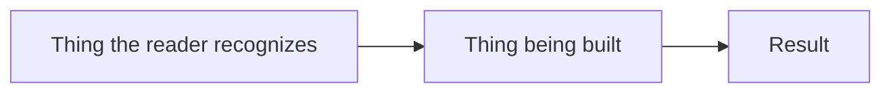

# \<System / Feature Name\>: Solution Document

# Problem Statement

\<What was asked for, and why the current system can't do it. One or two paragraphs. No solution yet.\>

| Limit | Effect on the customer |
|---|---|
| | |

\<What the affected people do today instead, and why that doesn't scale.\>

# Executive Summary

\<Three or four short paragraphs: what is being built, what changes for the people already using the system (including "nothing changes for them", when that's the answer), the main benefit, the biggest risk or cost, and what the reader is being asked to decide.\>

# Scope

**In scope**

-

**Out of scope**

- \<Especially: what a reasonable person assumes is included but isn't.\>

# Requirements

## Functional

\<What the solution must do. Each item judgeable as met or unmet. Three to five is usually right.\>

| # | Requirement | How it's shown to be met |
|---|---|---|
| F1 | | |

## Non-Functional

\<Volumes, timing, availability, security posture, and operability. Give numbers. Mark any value that's proposed but not yet agreed.\>

| # | Requirement | Target | How it's shown to be met |
|---|---|---|---|
| N1 | | | |

# Constraints

\<What must be true for the solution to work, and what the solution doesn't control: where it runs, what must be available, what the customer is responsible for, and limits that aren't enforced.\>

-

# Architecture Diagram

*\<Caption: what to look at in this diagram.\>*

# High-Level Design

\<How it works, for a well-informed non-specialist. Ordinary word first, real term in brackets. One analogy, kept consistent.\>

\<Why the mechanism gives the guarantee. Give the reason, not the algorithm.\>

**What changes in practice**

\<What gets run, by whom, how often, what comes out, and what the reader arranges themselves. Name any group for whom nothing changes.\>

**Benefits**

| Benefit | Why it matters |
|---|---|
| | \<A consequence for someone, not a property of the system.\> |

# Concerns

**Behavior when things go wrong**

\<Governing principle in one sentence.\>

| Situation | What happens |
|---|---|
| | \<Outcome, not mechanism.\> |

\<What this means operationally: how someone detects a failure, gets alerted, and retries.\>

**Open questions**

| # | Question | Owner | Status |
|---|---|---|---|
| 1 | | | Open. \<Blocks sign-off / blocks work starting.\> |

# Risks

| # | Risk | Impact | Mitigation | Owner |
|---|---|---|---|---|
| 1 | | \<What happens to someone.\> | | |

# Alternatives

## \<Status quo / do nothing\>

**Description:**

**Tradeoffs:**

**Why not chosen:**

## \<Rejected option\>

**Description:**

**Tradeoffs:**

**Why not chosen:**

## \<Chosen option\>

**Description:**

**Tradeoffs:** \<including its real cost\>

**Why chosen:**

# Data flow

\<What information moves, from which system or person to which, how often, and where it ends up.\>

| Information | From | To | How often | Kept for |
|---|---|---|---|---|
| | | | | |

\<Any sensitive information (personal, commercially sensitive, safety-related), where it's kept, and who can see it.\>

# Interfaces

**People**

| Who | How they use it | What they get |
|---|---|---|
| | \<Screen, report, scheduled job, command line.\> | |

**Systems**

| System | Owner | Reads from / writes to | Change required of the owner |
|---|---|---|---|
| | | | |

# Appendix

## References

| Document | Link |
|---|---|
| Design document | |
| | |

## Glossary

| Term | Meaning |
|---|---|
| | \<Plain language, written for this reader.\> |

---

*Before handing this over, run the `unslop` skill over the whole document, tables included, and
delete this line.*
