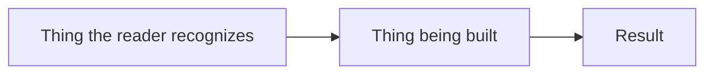

# \<System / Feature Name\>: Solution Document

| | |
|---|---|
| **Status** | Draft / In Review / Approved |
| **Audience** | \<who this is written for\> |
| **Technical detail** | \<link to the design document\> |
| **Last updated** | YYYY-MM-DD |

## 1. Introduction

### 1.1 Problem Statement

\<What was asked for, and why the current system can't do it. One or two paragraphs. No solution yet.\>

### 1.2 Overview

\<What is being built, in three or four short paragraphs. What changes for the people already using the system, including "nothing changes for them", when that's the answer.\>

**In scope**

-

**Out of scope**

- \<Especially: what a reasonable person assumes is included but isn't.\>

### 1.3 Background

\<Why the current situation is a problem, in the reader's terms rather than the system's.\>

| Limit | Effect on the customer |
|---|---|
| | |

\<What the affected people do today instead, and why that doesn't scale.\>

## 2. Requirements

### 2.1 Functional

\<What the solution must do. Each item judgeable as met or unmet. Three to five is usually right.\>

| # | Requirement |
|---|---|
| F1 | |

### 2.2 Non-Functional

\<Volumes, timing, availability, security posture, and operability. Give numbers. Mark any value that's proposed but not yet agreed.\>

| # | Requirement | Target |
|---|---|---|
| N1 | | |

### 2.3 Constraints

\<What must be true for the solution to work, and what the solution doesn't control: where it runs, what must be available, what the customer is responsible for, and limits that aren't enforced.\>

-

## 3. Solution

### 3.1 Architecture Diagram

*\<Caption: what to look at in this diagram.\>*

### 3.2 High-Level Design

\<How it works, for a well-informed non-specialist. Ordinary word first, real term in brackets. One analogy, kept consistent.\>

\<Why the mechanism gives the guarantee. Give the reason, not the algorithm.\>

**What changes in practice**

\<What gets run, by whom, how often, what comes out, and what the reader arranges themselves. Name any group for whom nothing changes.\>

**Benefits**

| Benefit | Why it matters |
|---|---|
| | \<A consequence for someone, not a property of the system.\> |

### 3.3 Alternatives

#### \<Status quo / do nothing\>

**Description:**

**Tradeoffs:**

**Why not chosen:**

#### \<Rejected option\>

**Description:**

**Tradeoffs:**

**Why not chosen:**

#### \<Chosen option\>

**Description:**

**Tradeoffs:** \<including its real cost\>

**Why chosen:**

## 4. Concerns

### 4.1 Behavior When Things Go Wrong

\<Governing principle in one sentence.\>

| Situation | What happens |
|---|---|
| | \<Outcome, not mechanism.\> |

\<What this means operationally: how someone detects a failure, gets alerted, and retries.\>

### 4.2 Risks

| # | Risk | Impact | Mitigation | Owner |
|---|---|---|---|---|
| 1 | | \<What happens to someone.\> | | |

### 4.3 Validation

1. **\<Claim\>**. \<The evidence that shows it's true.\>
2.
3.

### 4.4 Open Questions

| # | Question | Owner | Status |
|---|---|---|---|
| 1 | | | Open. \<Blocks sign-off / blocks work starting.\> |

## 5. Appendix

### 5.1 References

| Document | Link |
|---|---|
| Design document | |
| | |

### 5.2 Glossary

| Term | Meaning |
|---|---|
| | \<Plain language, written for this reader.\> |

---

*Before handing this over, run the `unslop` skill over the whole document, tables included, and
delete this line.*
